# Projet d'Étude sur les animes

## Table des Matières
- [Projet d'Étude sur les animes](#projet-détude-sur-les-animes)
  - [Table des Matières](#table-des-matières)
  - [Description](#description)
  - [Installation](#installation)
  - [Démarrage](#démarrage)
  - [Utilisation](#utilisation)
  - [User Guide](#user-guide)
    - [Déploiement](#déploiement)
    - [Description des fonctionnalités et interactions avec l'utilisateur](#description-des-fonctionnalités-et-interactions-avec-lutilisateur)
      - [1. Liens vers les Animes les mieux notés :](#1-liens-vers-les-animes-les-mieux-notés-)
      - [2. Frise de Sélection par rang :](#2-frise-de-sélection-par-rang-)
      - [3. Recherche d'Anime :](#3-recherche-danime-)
      - [4. Graphiques Interactifs :](#4-graphiques-interactifs-)
      - [5. Mise à jour dynamique des graphiques :](#5-mise-à-jour-dynamique-des-graphiques-)
      - [6. Affichage des détails de l'Anime recherché :](#6-affichage-des-détails-de-lanime-recherché-)
  - [Developper Guide](#developper-guide)
    - [Architecture du Code](#architecture-du-code)
    - [Organigramme (Programmation Impérative)](#organigramme-programmation-impérative)
    - [Docstrings](#docstrings)
  - [Explication de chaque partie de notre projet](#explication-de-chaque-partie-de-notre-projet)
    - [1. Le scraping](#1-le-scraping)
    - [2. La base de données MongoDB](#2-la-base-de-données-mongodb)
    - [3. La conteneurisation Docker Desktop](#3-la-conteneurisation-docker-desktop)
    - [4. Le dashboard](#4-le-dashboard)
  - [Rapport d'Analyse](#rapport-danalyse)
    - [1. Les données](#1-les-données)
    - [2. Observations](#2-observations)
  - [Classement des 10 premiers animes](#classement-des-10-premiers-animes)
  - [Frise de Sélection par rang](#frise-de-sélection-par-rang)
  - [Recherche d'Anime](#recherche-danime)
  - [Histogramme des studios les plus productifs](#histogramme-des-studios-les-plus-productifs)
  - [Histogramme du statut des Animes](#histogramme-du-statut-des-animes)
  - [Diagramme circulaire des genres les plus populaires](#diagramme-circulaire-des-genres-les-plus-populaires)
  - [Histogramme du nombre d'épisodes](#histogramme-du-nombre-dépisodes)

## Description
Ce projet vise à réaliser le scraping de données à partir d'un site internet. Nous avons décidé de recueillir les données de la page web : https://myanimelist.net/topanime.php. Les données extraites sont ensuite stockées dans une base de données créée sur MongoDB. Une fois les données rassemblées, elles sont analysées et les résultats sont présentés de manière interactive à travers un site web, mis en œuvre à l'aide du framework Dash. Cela permettra aux utilisateurs d'explorer les informations sur le classement des meilleurs animes directement depuis l'interface conviviale du site. Pour assurer une mise en œuvre et un déploiement efficaces, l'ensemble des services du projet sera encapsulé dans trois conteneurs Docker dédiés à la partie : scraping, mongo, dash. 

Notre projet comprend 3 sous-parties :

1) Le scrapping d'un site web à partir de la libraire Scrapy
2) La création d'une base de données à partir de MongoDB
3) La visualisation des résultats à partir du framework Dash

Nous nous sommes ainsi posé la question suivante : Existe-t-il une tendance entre les données de ce classement ? 

## Installation
Pour utiliser ce dashboard, suivez ces étapes :

1. Clônez le projet sur votre machine :
$ git clone https://git.esiee.fr/aumailll/amar_aumaille_projet_data_engineering

2. Installez les packages nécessaires à l'aide des fichiers `requirements.txt` présents dans les dossiers dash et scraping :
$ python -m pip install -r requirements.txt

Autrement dit : 
```
cd dash
python -m pip install -r requirements.txt
cd ..
cd scraping
python -m pip install -r requirements.txt
```


## Démarrage
1. Ouvrez l'application Docker Desktop 

2. Depuis le terminal, accédez au projet cloné grâce à la commande `cd chemin_vers_le_dossier_du_git_cloné`
   
3. Exécutez alors la commande suivante, elle vous permettra de démarrer des conteneurs Docker en arrière-plan qui ont été définis dans le fichier docker-compose.yml. :
$ docker-compose up -d

4. Depuis Docker Desktop, cliquez sur le lien encadré :
 
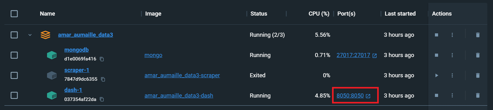

5. Vous accédez alors au dashboard de notre projet : 

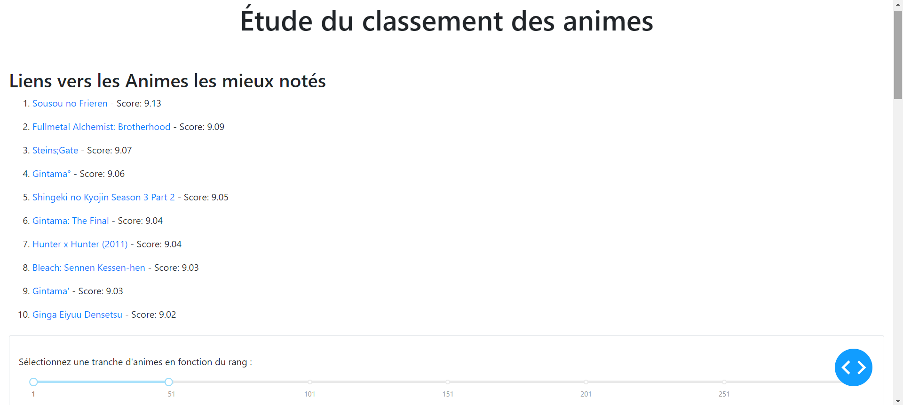


## Utilisation
Le tableau de bord est accessible via un navigateur web à l'adresse http://localhost:8050/. Vous pouvez interagir avec certaines sections du dashboard afin d'explorer les données extraites.


## User Guide
### Déploiement
1. Assurez-vous d'avoir installé Python sur votre machine.
2. Suivez les étapes d'installation ci-dessus.
3. Exécutez le projet en suivant les instructions de démarrage.


### Description des fonctionnalités et interactions avec l'utilisateur

#### 1. Liens vers les Animes les mieux notés :
Affiche les liens vers les 10 animes les mieux notés, avec la possibilité de naviguer vers chaque anime en cliquant sur les liens.

#### 2. Frise de Sélection par rang :
Une frise interactive permet à l'utilisateur de sélectionner une tranche d'animes en fonction de leur rang.
L'utilisateur peut définir la plage de rang en faisant glisser les curseurs sur la frise.

#### 3. Recherche d'Anime :
Une barre de recherche permet à l'utilisateur de rechercher des informations détaillées sur un anime spécifique.
L'utilisateur peut saisir le titre d'un anime dans la barre de recherche.

#### 4. Graphiques Interactifs :
* Histogramme des studios les plus productifs :
Affiche la distribution des studios en fonction du nombre d'animes produits.

* Histogramme du statut des Animes :
Présente la répartition des animes en fonction de leur statut (en cours, terminé, etc.).

* Diagramme circulaire des genres les plus populaires :
Affiche la distribution des genres d'animes sous forme de diagramme circulaire.

* Histogramme du nombre d'épisodes :
Présente la distribution du nombre d'épisodes par anime.

#### 5. Mise à jour dynamique des graphiques :
Les graphiques se mettent à jour dynamiquement en fonction de la tranche d'animes sélectionnée à l'aide de la frise.

#### 6. Affichage des détails de l'Anime recherché :
Lorsque l'utilisateur effectue une recherche, les détails de l'anime recherché sont affichés, y compris le titre, le score, les studios, les genres, le statut, et le nombre d'épisodes.


## Developper Guide
### Architecture du Code
L'architecture du code est basée sur une structure modulaire utilisant la bibliothèque Dash de Plotly. Voici une représentation graphique de l'architecture :


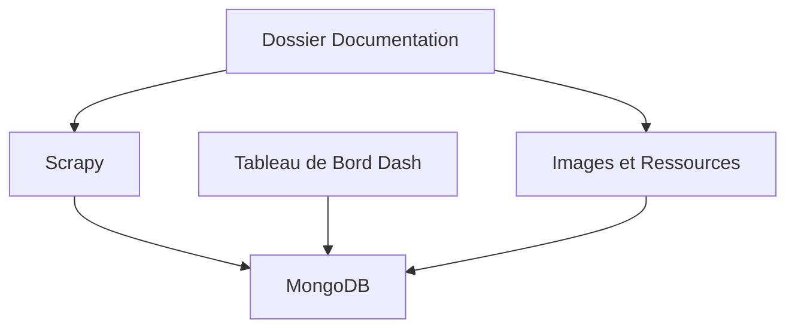

### Organigramme (Programmation Impérative)
Pour la programmation impérative, l'organigramme principal est le suivant :

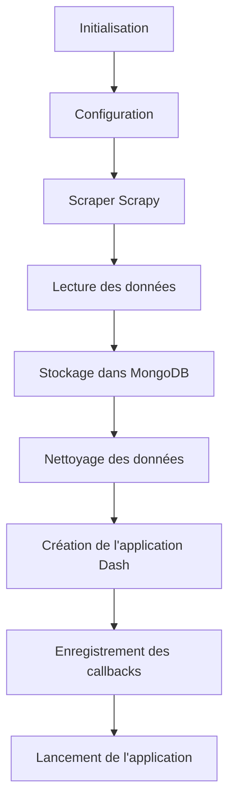


### Docstrings
La documentation détaillée des fonctions et des classes se trouve directement dans le code via des docstrings. Assurez-vous de consulter ces docstrings pour comprendre le fonctionnement de chaque composant.

## Explication de chaque partie de notre projet
### 1. Le scraping 
Notre but est d'extraire des données à partir de sites web de manière automatisée. Nous avons créé une spider à l'aide du framework Scrapy. La spider, nommée `anime`, est conçue pour extraire des informations sur le top 300 des animes du site myanimelist.net.

La spider commence par définir les URLs de départ dans la liste start_urls. Ensuite, la méthode parse est utilisée pour traiter la page principale contenant la liste des animes. En parcourant les éléments HTML correspondant aux informations de chaque anime, la spider extrait des détails tels que le classement, le titre, le lien, et le score. Pour chaque anime, un objet Python (item) est créé pour stocker ces informations, puis la spider suit le lien vers la page détaillée de l'anime en utilisant scrapy.Request.

La méthode parse_anime_page est chargée d'extraire des informations supplémentaires à partir de la page détaillée de chaque anime. Elle récupère des détails tels que le nombre d'épisodes, le statut, le studio, les producteurs, le type, les genres, et les thèmes. Toutes ces données sont stockées dans l'objet item et ajoutées à la liste results. Une fois que toutes les pages ont été traitées, la méthode closed est appelée pour trier les résultats par le champ 'rank' et les sauvegarder dans un fichier CSV, nommé anime_data.csv, créant ainsi un ensemble de données structuré à partir du scraping.

Il est possible d'afficher les résultats de ce fichier. Pour ce faire, il faut se déplacer dans le dossier contenant la spider : scraping > scraping > spiders. Puis, il suffit d'exécuter la commande `scrapy crawl anime` dans le terminal. Autrefois, notre script contenait également la création et la sauvegarde d'un fichier csv. 

**Extrait du résultat depuis le terminal datant du 16 janvier 2024 :**

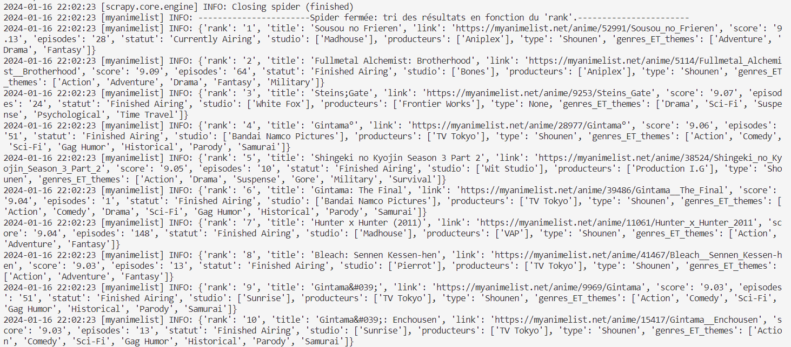

**Extrait du fichier anime_data.csv datant du 16 janvier 2024 :**

| rank |                title                 |                                      link                                      | score | episodes |      statut      |       studio        |        producteurs         |   type   |                  genres_ET_themes                   |
|------|-------------------------------------|------------------------------------------------------------------------------|-------|----------|-------------------|----------------------|----------------------------|----------|-----------------------------------------------------|
|   1  | Sousou no Frieren                  | [Sousou no Frieren](https://myanimelist.net/anime/52991/Sousou_no_Frieren)  |  9.13 |   28     | Currently Airing | ['Madhouse']         | ['Aniplex']                | Shounen  | ['Adventure', 'Drama', 'Fantasy']                   |
|   2  | Fullmetal Alchemist: Brotherhood    | [Fullmetal Alchemist: Brotherhood](https://myanimelist.net/anime/5114/Fullmetal_Alchemist__Brotherhood) |  9.09 |   64     | Finished Airing  | ['Bones']            | ['Aniplex']                | Shounen  | ['Action', 'Adventure', 'Drama', 'Fantasy', 'Military'] |
|   3  | Steins;Gate                         | [Steins;Gate](https://myanimelist.net/anime/9253/Steins_Gate)                |  9.07 |   24     | Finished Airing  | ['White Fox']        | ['Frontier Works']         |          | ['Drama', 'Sci-Fi', 'Suspense', 'Psychological', 'Time Travel'] |
|   4  | Gintama°                            | [Gintama°](https://myanimelist.net/anime/28977/Gintama°)                    |  9.06 |   51     | Finished Airing  | ['Bandai Namco Pictures'] | ['TV Tokyo']               | Shounen  | ['Action', 'Comedy', 'Sci-Fi', 'Gag Humor', 'Historical', 'Parody', 'Samurai'] |
|   5  | Shingeki no Kyojin Season 3 Part 2  | [Shingeki no Kyojin Season 3 Part 2](https://myanimelist.net/anime/38524/Shingeki_no_Kyojin_Season_3_Part_2) |  9.05 |   10     | Finished Airing  | ['Wit Studio']       | ['Production I.G']         | Shounen  | ['Action', 'Drama', 'Suspense', 'Gore', 'Military', 'Survival'] |
|   6  | Gintama: The Final                  | [Gintama: The Final](https://myanimelist.net/anime/39486/Gintama__The_Final) |  9.04 |   1      | Finished Airing  | ['Bandai Namco Pictures'] | ['TV Tokyo']               | Shounen  | ['Action', 'Comedy', 'Drama', 'Sci-Fi', 'Gag Humor', 'Historical', 'Parody', 'Samurai'] |
|   7  | Hunter x Hunter (2011)              | [Hunter x Hunter (2011)](https://myanimelist.net/anime/11061/Hunter_x_Hunter_2011) |  9.04 |   148    | Finished Airing  | ['Madhouse']         | ['VAP']                    | Shounen  | ['Action', 'Adventure', 'Fantasy']                |
|   8  | Bleach: Sennen Kessen-hen           | [Bleach: Sennen Kessen-hen](https://myanimelist.net/anime/41467/Bleach__Sennen_Kessen-hen) |  9.03 |   13     | Finished Airing  | ['Pierrot']          | ['TV Tokyo']               | Shounen  | ['Action', 'Adventure', 'Fantasy']                |
|   9  | Gintama&#039;                       | [Gintama&#039;](https://myanimelist.net/anime/9969/Gintama)                |  9.03 |   51     | Finished Airing  | ['Sunrise']          | ['TV Tokyo']               | Shounen  | ['Action', 'Comedy', 'Sci-Fi', 'Gag Humor', 'Historical', 'Parody', 'Samurai'] |
|  10  | Gintama&#039;: Enchousen            | [Gintama&#039;: Enchousen](https://myanimelist.net/anime/15417/Gintama__Enchousen) |  9.03 |   13     | Finished Airing  | ['Sunrise']          | ['TV Tokyo']               | Shounen  | ['Action', 'Comedy', 'Sci-Fi', 'Gag Humor', 'Historical', 'Parody', 'Samurai'] |


Chaque ligne du DataFrame représente un anime spécifique avec ses caractéristiques respectives. L'inclusion de données telles que le studio, les producteurs, les genres, et d'autres informations pertinentes, offre une vue détaillée sur la diversité des animes présentés dans le top 300 sur MyAnimeList. L'utilisation de liens directs vers les pages des animes permet également une intégration facile avec d'autres sources d'information. Cela pourrait être particulièrement utile dans le cadre d'une application Web qui explore ces données.

Nous réaliserons par la suite une analyse de données permettant notamment de savoir quel est le genre le plus représenté dans ce classement.

### 2. La base de données MongoDB
Une fois le scraping des données réalisé, nous avons dû stocker les données dans une base de données afin de pouvoir les exploiter par la suite.
 Pour ce faire, nous avons utilisé la base de données *MongoDB*. C'est une base de données open source orienté documents. 
 L'avantage de cet outil est la possibilité de stocker les données sans avoir prédéfini un schéma de fixe pour les données. Autrement dit, nul besoin de définir une structure de table avant de stocker les données.
 <br> 


 Nous avons utilisé MongoDB sous deux formes :
 - En local avec les logiciels *MongoDB* et *Mongosh* dont le lien pour l'installation est disponible [ici](https://www.mongodb.com/docs/manual/tutorial/install-mongodb-on-ubuntu/). Mongosh est le shell de MongoDB qui permet d'interagir avec les bases de données de MongoDB via une interface de ligne de commandes.
 Par ailleurs, MongoDB offre une interface graphique utilisateur *MongoDBCompass* permettant d'explorer les données et d'effectuer des requêtes.

 - Avec Docker avec l'image *mongo* officielle pour Docker. C'est cette utilisation de Mongo qui est proposée dans ce projet ne dépendant pas de la machine hôte.

 <br>

 L'utilisation de MongoDB se retrouve dans les scripts du scraping des données (anime.py) et dans le dashboard (app.y).
 Pour illustrer nos propos, voici l'utilisation de Mongo dans le code du scraping :

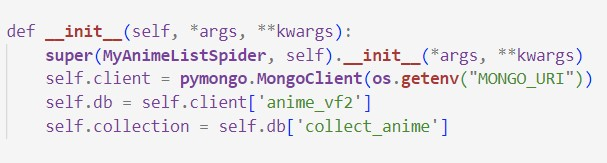  
Ainsi, nous avons créé une base de données nommée : "anime_vf2" et une collection "collect_anime". "MONGO_URI" spécifie la connexion, l'endroit où se trouve la base de données.  
Il y a plusieurs informations que nous avons récupérées du site choisi : 
- le classement
- le titre
- le lien qui mène à la description plus précise de l'anime
- le score ( noté /10)
- le nombre d'épisodes
- le statut (en cours ou fini)
- le studio
- le producteur
- le type
- les genre et thèmes

Nous avons choisi de sélectionner ces informations pour l'analyse et la visualisation ultérieure des données. Voici le code qui nous a permis de sauvegarder ces informations dans la base de données :  

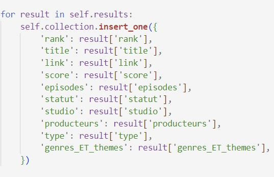 

Voic un exemple résultant du stockage d'un anime : 

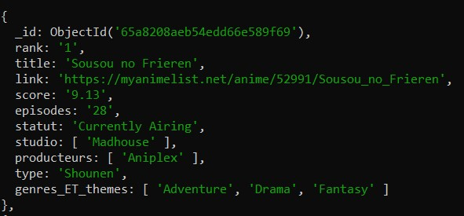 

Enfin, nous avons réutilisé la base de données créée dans le dashboard pour l'exploration et l'analyse de nos données. Nous avons choisi de stocker la collection dans un DataFrame, ayant l'habitude de travailler avec. 


### 3. La conteneurisation Docker Desktop
Docker est une plateforme open source qui automatise le déploiement d'applications, de services dans des conteneurs légers. Pour faire fonctionner une application à partir de Docker, nous devons spécifier une image à partir de laquelle sera crée un conteneur, le code de l'application, et les dépendances. Docker repose sur deux notions clés que l'on vient de citer : les conteneurs et les images.
- L'image contient tout le nécessaire pour exécuter une application, elle est créée (ou récupérée à partir d'un registre distant) dans le Dockerfile
- Le conteneur est une instance en cours d'exécution d'une image. Il permet d'isoler l'application par rapport à l'hôte.    

Nous utilisons également le logiciel *Docker Dekstop* qui fournit un environnement de développement Docker complet. Il introduit également une interface graphique utilisateur et des fonctionnalités simple à utiliser.


Dans le cadre de ce projet, nous avons utilisé l'outil *Docker compose* qui permet de gérer des applications multi-conteneurs. En effet, nous avons décidé d'utiliser trois conteneurs pour le déploiement de notre site : 
- un pour Mongo : afin d'utiliser l'outil de base de données MongoDB, nous instancions un conteneur avec l'image officielle pour Mongo sur Docker Hub
- un pour le dashboard : on crée un conteneur qui contiendra le code du site et permettra de le lancer à partir de n'importe quelle machine. Il dépend du conteneur de Mongo pour l'exploitation des données
- un pour le scraping des données : nous démarrons un conteneur pour la récupération des données à partir de l'inspection du code source du site. Il dépend du conteneur Mongo pour le stockage des données  


Pour définir ces trois conteneurs, nous avons créé et rempli comme il se doit le fichier "docker-compose.yml". Ce fichier permet de configurer les conteneurs, les volumes, les environnements, les services... C'est la base de la création d'applications multi-conteneurs. Dans ce fichier, nous spécifions l'architecture, la structure de nos conteneurs.   
Voilà à quoi correspond notre fichier de configuration YAML : 

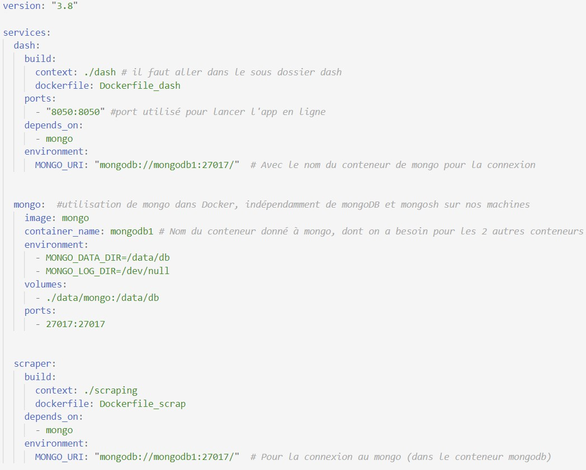 


En parallèle, nous avons créé deux Dockerfiles comme vous pouvez le voir sur l'image ci-dessus pour créer les images des conteneurs de l'application et du scraping. 
Dans ces Dockerfiles, nous copions tous les dossiers et fichiers nécessaires pour la création de l'image et le fonctionnement du conteneur. Nous installons les dépédences contenues dans un fichier "requirements.txt" et nous notons les commandes à exécuter pour d'un côté scraper les données et de l'autre lancer le dashboard en ligne.  


Vous pouvez voir ci-dessous l'un des dockerfiles conçus pour ce projet :  
  
```docker
# Dockerfile pour le conteneur du dashboard 

FROM python:3.8

WORKDIR /app

#On copie tout ce qu'il y a dans le dossier du dashboard
COPY . /app

#On installe les dépendances pour la bonne exécution du code
RUN pip install -r requirements.txt

#On définit le port qu'on utilisera pour accéder à notre site
EXPOSE 8050

# Commande  pour exécuter l'application application
CMD ["python", "app.py"]
```
    
Enfin, pour créer et démarrer nos conteneurs, nous nous rendons sur le terminal, nous nous plaçons dans le dossier qui contient le fichier "docker-compose.yml" et nous ajoutons cette ligne : **docker-compose up --build**. Cela construit les images et démarre les conteneurs comme indiqué dans le fichier "docker-compose.yml". Enfin, nous pouvons voir sur le terminal et via Docker Dekstop que les conteneurs ont bien été créés et sont en cours d'exécution. 

### 4. Le dashboard
Afin de visualiser les données, nous avons décidé de réaliser un dashboard avec Dash. Cela rend notre application plus visuelle et facile à utiliser. Ainsi, nous avons crée un dashboard montrant les informations importantes de notre liste d'animes. Les utilisateurs pourront filtrer et rechercher les données qui les intéressent. Nous avons aussi décidé d'ajouter des graphiques interactifs et un design épuré pour rendre notre application non seulement informative, mais aussi agréable à utiliser. Afin de filtrer, l'utilisateur devra choisir la tranche du classement à visualiser (entre 1 et 300). 

Le dashboard est accessible depuis le fichier `app.py` présent dans le dossier dash du projet. 

Il est possible d'afficher le dashboard depuis ce script, en exécutant la commande `python app.py` dans le terminal. A noter, il est nécessaire d'avoir préalablement exécuté dans le terminal : `srapy crawl anime`.


## Rapport d'Analyse
### 1. Les données

A partir d'ici on suppose que les données on déjà été traitées.

Dans notre jeu de données on retrouve les informations classiques de 300 animes issus d'un classement fondé par le score. Nos données datent du 16 janvier 2023. Nous avons en tout **300 observations/lignes** et **10 variables**.
  
Voici la structure du jeu de données pre-traitement :

<br>

| Variable              | Description                                            |
|-----------------------|--------------------------------------------------------|
| rank                  | Le classement attribué en fonction du score.           |
| title                 | Le titre de l'anime ou du film d'animation.                 |
| link                  | Le lien ou l'URL associé à l'anime ou du film d'animation.   |
| score                 | Le score attribué à l'anime ou du film d'animation.          |
| episodes             | Le nombre d'épisodes de l'anime ou du film d'animation.     |
| statut               | Le statut actuel de l'anime.         |
| studio               | Le studio de production responsable de l'anime ou du film d'animation.  |
| producteurs          | Les producteurs associés à la création de l'anime ou du film d'animation.   |
| type                 | Le type de l'anime. Par exemple : Shounen, shojo, etc.  |
| genres_ET_themes     | La catégorisation des genres et thèmes associés à l'anime ou du film d'animation.  |


### 2. Observations

Analysons notre jeu de données afin de répondre à notre problématique. Nous utiliserons le plan suivant : 

- [Classement des 10 premiers animes](#classement-des-10-premiers-animes)
- [Frise de Sélection par rang](#frise-de-sélection-par-rang)
- [Recherche d'Anime](#recherche-danime)
- [Histogramme des studios les plus productifs](#histogramme-des-studios-les-plus-productifs)
- [Histogramme du statut des Animes](#histogramme-du-statut-des-animes)
- [Diagramme circulaire des genres les plus populaires](#diagramme-circulaire-des-genres-les-plus-populaires)
- [Histogramme du nombre d'épisodes](#histogramme-du-nombre-dépisodes)


## Classement des 10 premiers animes
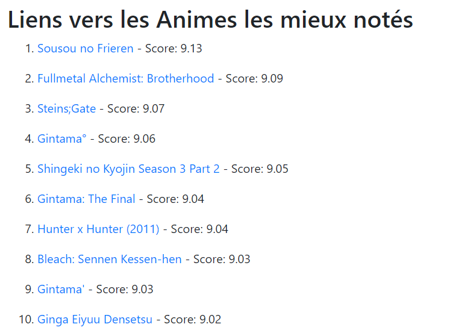

## Frise de Sélection par rang
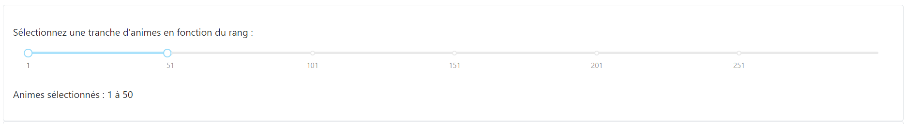

## Recherche d'Anime
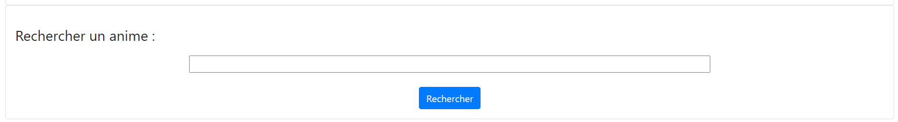

## Histogramme des studios les plus productifs
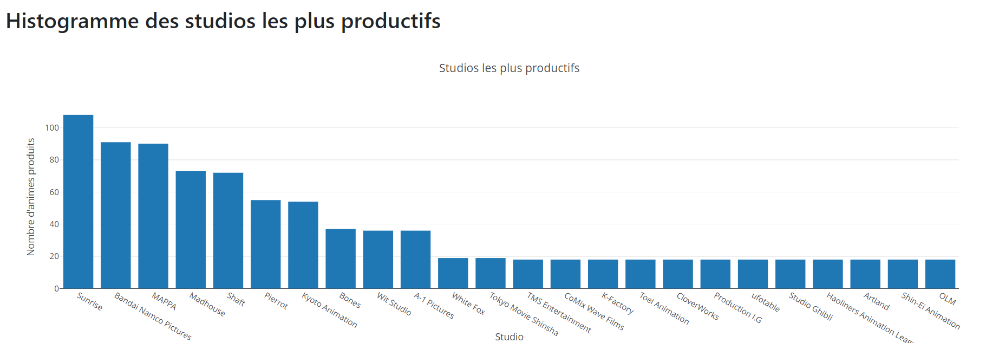

## Histogramme du statut des Animes
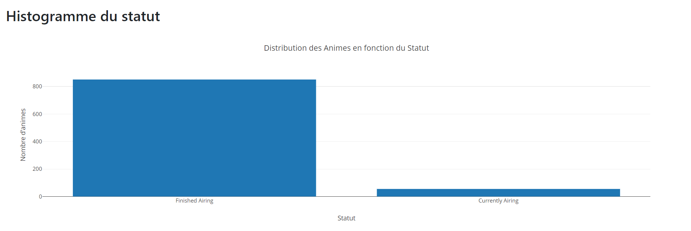

## Diagramme circulaire des genres les plus populaires
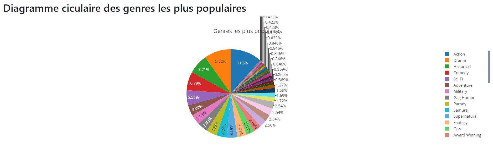

## Histogramme du nombre d'épisodes
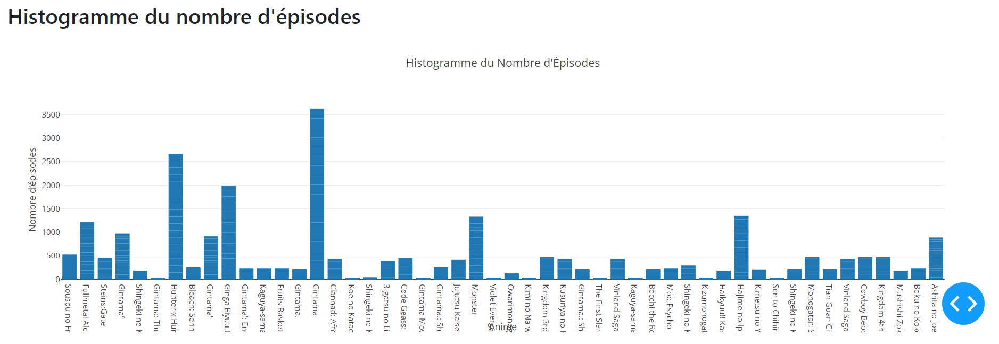